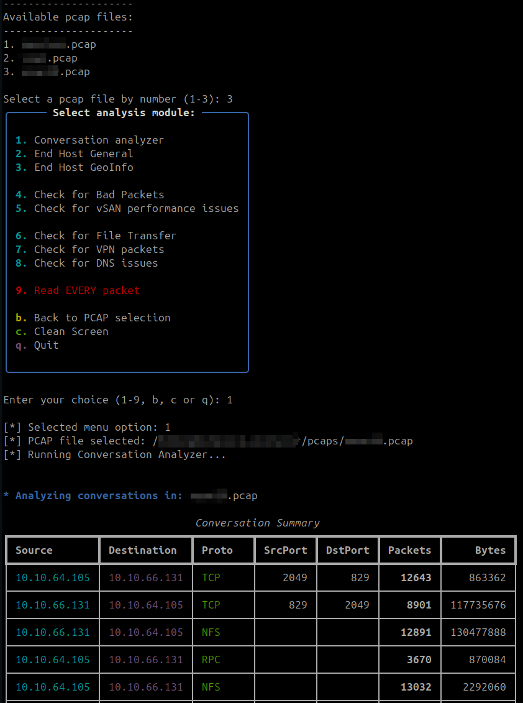
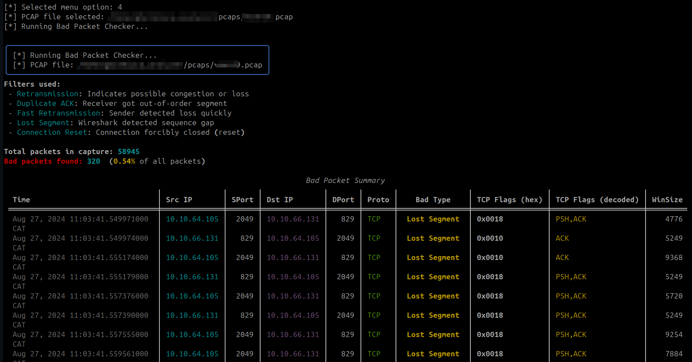
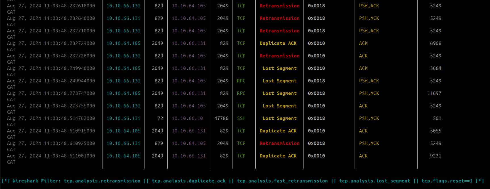

# PCAP diagnostics 

PCAP diagnostics is simple, menu-driven tool that helps you automate pcap file review. 

Powered by tshark modular approach to quickly peak into pcap files stored in ./pcaps directory. 


 

# Prerequisites

Python 3.8+ installed

tshark (Wireshark CLI): `sudo apt-get install tshark`

Python venv: `python3 -m venv venv; source venv/bin/activate; `

Python dependencies: `pip install -r requirements.txt`

For up-to-date geo‑location lookups, download latest MaxMind GeoLite2 City database into the geoipdb/ folder (basic one supplied)

Download link: `https://www.maxmind.com/en/accounts/1067801/geoip/downloads` 

Python geoip module installed: `sudo apt install python3-geoip2` 


# Installation

Clone or unzip the repository.

Create a virtual environment:

```bash
python3 -m venv venv
source venv/bin/activate
pip install -r requirements.txt
```

Make sure your PCAP files live in the `./pcaps/` directory.

### Quickstart: 

Run the Analyzer: `python3 pcap_analyzer.py`

First enter the number of the file you want to inspect.

Next, from the menu pick what you’d like to do with pcap. 




### 1. Conversation Analyzer
- shows who talked to whom (IP pairs, protocols, packet counts, bytes)


### 2. End Host General 
- top talkers, traffic in/out per host, port usage, scan detection


### 3. End Host GeoInfo 
- same as above + country, city, ISP details via GeoIP


### 4. Bad Packet Checker 
- hunts for malformed or suspicious packets




- wireshark filter like used to color bad packets, more info see **wireshark_CrashCourse**




### 5. vSAN Perf Checker 
- specialized checks for VMware vSAN performance


### 6. File Transfer Checker 
- finds big file transfers in your capture


### 7. VPN Packet Checker 
- spots VPN tunnels and traffic


### 8. DNS Issues: 
- quick tshark troubleshooter for DNS problems


### 9. Read Every Packet 
- stream raw packet lines (with pagination and colors!)
 